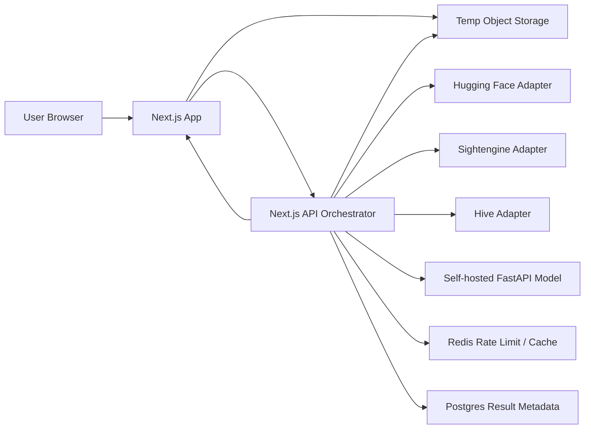
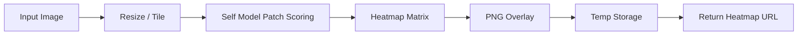
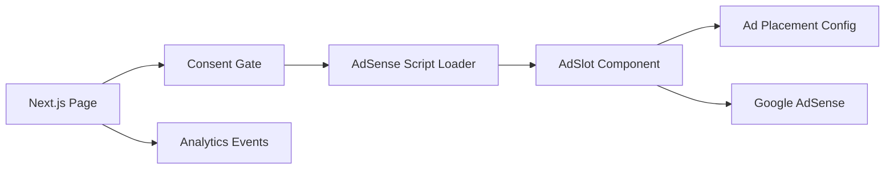
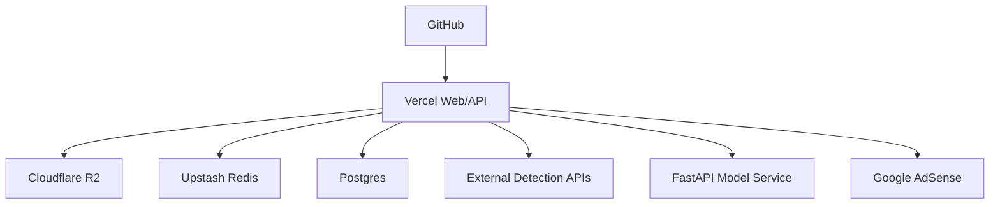

# AI Image Checker 技术方案文档

> 版本：v1.0  
> 日期：2026-05-26  
> 输入依据：`prd.md`、`index.html` 原型  
> 目标：把 PRD 与静态原型转化为可开发、可部署、可扩展的技术实施方案

---

## 1. 背景与目标

AI Image Checker 是面向海外用户的免费 AI 生成图片检测工具。产品核心体验是：用户上传图片或粘贴图片 URL 后，在 3 秒左右获得多引擎检测结果、综合 AI 概率、单引擎评分与可视化解释。

当前原型已经明确了首屏体验、上传交互、处理中状态、引擎进度、结果卡片、热力图展示、Features 与基础 SEO 文案。技术方案需要把这些界面状态连接到真实服务能力，并保证 MVP 可快速上线。

### 1.1 技术目标

- 支持 JPG、PNG、WebP、GIF 上传，单文件最大 20MB。
- 支持图片 URL 检测，包含基础直链与可扩展的平台解析能力。
- 同时调用 3-5 个检测引擎，输出统一评分。
- 任一检测引擎失败时不阻断整体结果。
- P0 检测链路目标响应时间控制在 3 秒左右。
- 不长期存储用户图片，检测后删除临时文件。
- 页面首屏加载目标小于 2 秒，适配移动端。
- 架构支持后续热力图、历史、分享、API、浏览器扩展。

### 1.2 MVP 范围

MVP 优先交付 PRD 中 P0 能力，并为 P1 留接口扩展点：

| 范围 | MVP 是否实现 | 说明 |
|---|---:|---|
| 图片拖拽/选择上传 | 是 | 对齐原型上传区 |
| URL 图片检测 | 是 | 先支持图片直链，社交平台解析作为增强 |
| 多引擎检测 | 是 | 至少 3 个引擎 |
| 综合评分 | 是 | 加权平均 + 置信度 |
| 单引擎结果 | 是 | 对齐原型 engine rows |
| 热力图 | 半实现 | 仅在自建模型支持时返回真实结果；否则显示明确占位 |
| 本地历史 | 是 | localStorage 保存最近 50 条 |
| 分享结果 | 否，预留 | Phase 2 实现 `/result/[id]` |
| 注册/付费 | 否 | MVP 不引入账号体系 |

---

## 2. 关键技术决策

### 2.1 推荐技术栈

| 层级 | 技术 | 用途 |
|---|---|---|
| Web 前端 | Next.js 14 App Router + React 18 + TypeScript | 页面、交互、SEO |
| 样式 | Tailwind CSS + CSS Variables | 复刻原型视觉系统 |
| API 编排 | Next.js Route Handlers，Node.js Runtime | 上传、URL 下载、多引擎并发调用 |
| 临时文件 | Cloudflare R2 或 S3 兼容对象存储 | 20MB 图片临时存放与生命周期清理 |
| 数据库 | Postgres，可用 Neon/Supabase | 分享结果、API key、使用量 |
| 缓存/限流 | Upstash Redis | IP 限流、结果短缓存、队列状态 |
| 检测引擎 | Hugging Face + Sightengine + Hive + 自建模型服务 | 多引擎检测 |
| 自建模型服务 | FastAPI + PyTorch/ONNX，部署到 Modal/Fly.io/Cloud Run/HF Space | Python 推理，不放在 Vercel Edge |
| 部署 | Vercel + 独立模型服务 | Web/API 与模型推理解耦 |
| 监控 | Vercel Analytics + Sentry + 日志采样 | 性能、错误和调用成本 |

### 2.2 对 PRD 技术栈的修正

PRD 中提到“Python + FastAPI，部署在 Vercel Edge”。该组合不建议采用：Vercel Edge Runtime 不适合运行 Python FastAPI 和深度学习推理。推荐将自建模型作为独立服务部署，Next.js API 只负责鉴权、上传、并发编排、聚合和降级。

### 2.3 为什么需要临时对象存储

直接把 20MB 图片通过 Serverless API 全量中转会受函数体积、执行时间和内存限制影响，也不利于后续分享、重试和异步任务。推荐流程是：

1. 前端请求上传签名。
2. 前端直传图片到 R2/S3 临时 bucket。
3. API 用临时对象 URL 调用检测引擎。
4. 检测完成后删除对象，bucket 设置兜底生命周期清理。

MVP 为了更快上线，可以先使用 API 直传；正式上线前应切到预签名直传。

---

## 3. 系统架构



### 3.1 分层职责

| 层 | 职责 |
|---|---|
| 页面层 | 首页、检测页、结果页、SEO Landing Pages |
| 组件层 | 上传区、URL 输入、处理中、评分卡、引擎结果、热力图、历史列表 |
| API 编排层 | 校验输入、下载 URL、上传预签名、并发调用引擎、超时控制、结果聚合 |
| 引擎适配层 | 将不同供应商响应转换为统一 `EngineResult` |
| 存储层 | 临时图片、检测元数据、分享结果、API key 与用量 |
| 运营层 | SEO 页面、博客、AdSense、反馈收集 |

### 3.2 运行时选择

| API | Runtime | 原因 |
|---|---|---|
| `/api/upload-url` | Node.js | 签名对象存储请求 |
| `/api/check` | Node.js | 处理 multipart 或 object key，调用第三方 API |
| `/api/check-url` | Node.js | 需要服务端下载远程图片并做安全校验 |
| `/api/result/[id]` | Node.js | 读取分享结果 |
| 纯 SEO 页面 | Static/ISR | 提升首屏与 SEO |

检测 API 不放 Edge Runtime，因为图片处理、第三方 SDK、超时控制和服务端下载更适合 Node.js Runtime。

---

## 4. 前端技术方案

### 4.1 页面路由

| 路由 | 类型 | 说明 |
|---|---|---|
| `/` | 静态/ISR | 首页，包含检测入口，目标关键词 `ai image detector` |
| `/check` | 动态页面 | 检测主流程，可与首页复用组件 |
| `/detect` | 静态/ISR | SEO Landing Page，复用检测组件 |
| `/is-it-ai` | 静态/ISR | SEO Landing Page，复用检测组件 |
| `/result/[id]` | 动态页面 | 分享结果详情 |
| `/blog` | 静态/ISR | 博客列表 |
| `/blog/[slug]` | 静态/ISR | 博客详情 |
| `/api/check` | API | 文件/object key 检测 |
| `/api/check-url` | API | 图片 URL 检测 |

### 4.2 组件拆分

```text
app/
  page.tsx
  check/page.tsx
  result/[id]/page.tsx
components/
  detector/
    DetectorShell.tsx
    UploadZone.tsx
    UrlInput.tsx
    ProcessingState.tsx
    ResultPanel.tsx
    ScoreGauge.tsx
    EngineResultList.tsx
    HeatmapViewer.tsx
    DetectionHistory.tsx
  marketing/
    Header.tsx
    FeatureGrid.tsx
    Footer.tsx
lib/
  api-client.ts
  detector-types.ts
  history.ts
```

### 4.3 状态机设计

原型中的页面状态应落成明确状态机，避免上传、处理中、结果和错误状态互相覆盖。

```ts
type DetectorState =
  | { status: 'idle' }
  | { status: 'validating'; source: ImageSource }
  | { status: 'uploading'; source: FileSource; progress: number }
  | { status: 'analyzing'; jobId?: string; engineStates: EngineState[] }
  | { status: 'success'; result: DetectionResult }
  | { status: 'error'; error: DetectorError };
```

### 4.4 前端校验

| 校验项 | 规则 |
|---|---|
| 文件类型 | `image/jpeg`、`image/png`、`image/webp`、`image/gif` |
| 文件大小 | 最大 20MB |
| URL 协议 | 仅允许 `https://`，开发环境可允许 `http://localhost` |
| URL 格式 | 必须是有效 URL |
| UI 提示 | 使用页面内错误态，不使用 `alert()` |

### 4.5 本地历史

MVP 历史记录使用 localStorage，不保存原图二进制，只保存缩略图 Data URL 或临时预览 URL 的最小信息。

```ts
type LocalHistoryItem = {
  id: string;
  createdAt: string;
  sourceType: 'upload' | 'url';
  fileName?: string;
  imageUrl?: string;
  thumbnail?: string;
  score: number;
  verdict: 'real' | 'uncertain' | 'ai';
};
```

保存最近 50 条，超出后按时间删除。用户可以清除历史。

---

## 5. 后端 API 方案

### 5.1 API 总览

| 方法 | 路径 | 用途 |
|---|---|---|
| `POST` | `/api/upload-url` | 获取临时上传签名 |
| `POST` | `/api/check` | 对上传文件或对象 key 执行检测 |
| `POST` | `/api/check-url` | 下载远程图片并检测 |
| `GET` | `/api/result/[id]` | 获取分享结果 |
| `POST` | `/api/result` | 创建分享结果 |
| `GET` | `/api/health` | 健康检查 |

### 5.2 `/api/check` 请求

MVP 可支持两种输入。生产优先使用 `objectKey`。

```json
{
  "sourceType": "object",
  "objectKey": "temp/2026/05/26/uuid.webp",
  "fileName": "sample.webp",
  "mimeType": "image/webp"
}
```

兼容直传：

```http
POST /api/check
Content-Type: multipart/form-data

file=<binary>
```

### 5.3 `/api/check-url` 请求

```json
{
  "url": "https://example.com/image.jpg"
}
```

服务端必须执行 SSRF 防护：

- 只允许 `http`/`https`，生产默认只允许 `https`。
- 禁止内网 IP、localhost、link-local、metadata 地址。
- 限制最大响应体 20MB。
- 校验 `Content-Type` 与文件头魔数。
- 设置下载超时，建议 5 秒。
- 最多跟随 3 次重定向，每次重定向重新校验目标地址。

### 5.4 检测响应

```json
{
  "id": "det_01J...",
  "createdAt": "2026-05-26T12:00:00.000Z",
  "source": {
    "type": "upload",
    "fileName": "sample.webp",
    "mimeType": "image/webp",
    "width": 1024,
    "height": 768,
    "size": 1820342
  },
  "summary": {
    "score": 82,
    "verdict": "ai",
    "confidence": "high",
    "label": "Likely AI-Generated",
    "explanation": "Multiple engines detected strong indicators of AI generation in texture patterns and noise distribution."
  },
  "engines": [
    {
      "engine": "self_model",
      "displayName": "Neural Vision",
      "score": 88,
      "confidence": "high",
      "status": "success",
      "latencyMs": 720,
      "weight": 35
    }
  ],
  "heatmap": {
    "available": true,
    "url": "https://cdn.example.com/heatmaps/det_01J.png",
    "expiresAt": "2026-05-26T13:00:00.000Z"
  },
  "warnings": []
}
```

### 5.5 错误响应

```json
{
  "error": {
    "code": "UNSUPPORTED_FILE_TYPE",
    "message": "Only JPG, PNG, WebP and GIF images are supported.",
    "retryable": false
  }
}
```

常见错误码：

| code | HTTP | 说明 |
|---|---:|---|
| `UNSUPPORTED_FILE_TYPE` | 400 | 不支持的图片格式 |
| `FILE_TOO_LARGE` | 413 | 超过 20MB |
| `INVALID_IMAGE_URL` | 400 | URL 无效 |
| `URL_DOWNLOAD_FAILED` | 422 | 图片下载失败 |
| `RATE_LIMITED` | 429 | 超过免费检测限制 |
| `ENGINE_TIMEOUT` | 200 | 单引擎超时，作为 warnings 返回 |
| `NO_ENGINE_AVAILABLE` | 503 | 全部引擎不可用 |

---

## 6. 检测引擎编排

### 6.1 统一适配器接口

```ts
export type EngineResult = {
  engine: 'self_model' | 'hugging_face' | 'sightengine' | 'hive' | 'metadata';
  displayName: string;
  score: number;
  confidence: 'low' | 'medium' | 'high';
  status: 'success' | 'timeout' | 'failed' | 'skipped';
  latencyMs: number;
  weight: number;
  raw?: unknown;
  errorCode?: string;
};

export interface DetectionEngine {
  name: EngineResult['engine'];
  weight: number;
  timeoutMs: number;
  detect(input: DetectionInput): Promise<EngineResult>;
}
```

### 6.2 MVP 引擎配置

| 引擎 | 原型展示名 | 权重 | 超时 | 说明 |
|---|---|---:|---:|---|
| 自建模型 | Neural Vision | 35 | 1800ms | 主要可控能力 |
| Hugging Face | Texture AI | 25 | 1800ms | 免费/低成本开源模型 |
| Sightengine | Pixel Forensics | 20 | 1800ms | 商业 API |
| Metadata Scan | Metadata Scan | 20 | 300ms | EXIF、软件签名、尺寸/压缩异常 |

Hive 可作为 Phase 2 替换或补充 Sightengine。MVP 如成本敏感，可用 metadata adapter 作为第 4 引擎，前 3 个必须包含至少 2 个真实模型/商业检测服务。

### 6.3 并发与超时策略

- 所有引擎并发调用。
- 单引擎超时不阻塞整体响应。
- 总检测超时建议 2800ms，保证前端 3 秒体验。
- 至少 2 个引擎成功时返回综合结果。
- 只有 1 个引擎成功时返回结果但置信度降为 `low`，并给出 warning。
- 0 个引擎成功时返回 `NO_ENGINE_AVAILABLE`。

### 6.4 综合评分算法

```ts
function calculateComposite(results: EngineResult[]) {
  const valid = results.filter(r => r.status === 'success');
  const totalWeight = valid.reduce((sum, r) => sum + r.weight, 0);

  if (totalWeight === 0) {
    throw new Error('NO_ENGINE_AVAILABLE');
  }

  const score = Math.round(
    valid.reduce((sum, r) => sum + r.score * r.weight, 0) / totalWeight
  );

  const spread = Math.max(...valid.map(r => r.score)) - Math.min(...valid.map(r => r.score));
  const confidence =
    valid.length >= 3 && spread <= 25 ? 'high' :
    valid.length >= 2 && spread <= 40 ? 'medium' :
    'low';

  const verdict =
    score <= 30 ? 'real' :
    score <= 70 ? 'uncertain' :
    'ai';

  return { score, verdict, confidence };
}
```

### 6.5 阈值定义

| 分数 | verdict | 展示文案 | 颜色 |
|---:|---|---|---|
| 0-30 | `real` | Likely Authentic | green |
| 31-70 | `uncertain` | Uncertain | amber |
| 71-100 | `ai` | Likely AI-Generated | red |

PRD 写的是 31-70 不确定、71-100 AI。原型代码当前使用 `>=40` 作为不确定阈值，正式实现应按 PRD 修正到 31。

---

## 7. 热力图方案

### 7.1 MVP 方案

MVP 可以分两级实现：

1. 如果自建模型支持 Grad-CAM、patch score 或 segmentation 输出，则生成真实热力图。
2. 如果暂不支持真实热力图，则前端显示“Visual explanation coming soon”或仅展示非误导性占位，不应把随机渐变伪装成真实检测结果。

### 7.2 目标方案



热力图生成要求：

- 输出 PNG/WebP overlay。
- 与原图尺寸比例一致。
- 默认有效期 1 小时。
- 只有明确说明来源时才显示。
- 提供下载按钮作为 P1。

---

## 8. 数据模型

### 8.1 检测结果表

MVP 如不做分享，可以不写数据库，仅返回即时结果。本表用于 Phase 2 分享页和 API 计费。

```sql
create table detection_results (
  id text primary key,
  created_at timestamptz not null default now(),
  source_type text not null check (source_type in ('upload', 'url', 'api')),
  source_url_hash text,
  file_name text,
  mime_type text,
  width integer,
  height integer,
  size_bytes integer,
  score integer not null,
  verdict text not null check (verdict in ('real', 'uncertain', 'ai')),
  confidence text not null check (confidence in ('low', 'medium', 'high')),
  engine_results jsonb not null,
  heatmap_object_key text,
  expires_at timestamptz,
  is_shareable boolean not null default false
);
```

### 8.2 API Key 表

```sql
create table api_keys (
  id text primary key,
  user_id text,
  key_hash text not null unique,
  name text not null,
  status text not null default 'active',
  monthly_limit integer not null default 1000,
  created_at timestamptz not null default now(),
  last_used_at timestamptz
);
```

### 8.3 用量表

```sql
create table api_usage (
  id bigserial primary key,
  api_key_id text references api_keys(id),
  created_at timestamptz not null default now(),
  endpoint text not null,
  status_code integer not null,
  cost_units integer not null default 1,
  latency_ms integer
);
```

---

## 9. 安全与隐私

### 9.1 上传安全

- 文件大小限制 20MB。
- 校验 MIME 与文件头魔数，不信任浏览器传入的 `Content-Type`。
- 图片解码使用安全库，失败即拒绝。
- 对 GIF 只取首帧做 MVP 检测，Phase 2 再支持动图多帧。
- 临时对象 key 使用随机 UUID，不暴露用户原文件名。
- 对象存储设置生命周期，兜底自动删除。

### 9.2 URL 检测安全

- SSRF 防护是必须项。
- 禁止下载私网、回环、metadata、link-local 地址。
- 限制重定向次数。
- 限制下载字节数。
- 下载完成后做图片格式二次校验。

### 9.3 隐私策略

- 默认不保存用户上传原图。
- 日志中不记录完整 URL 查询参数，可记录 hash。
- 分享结果需要用户主动点击创建。
- 检测结果文案明确提示“结果仅供参考”。
- 如果接入 AdSense/Analytics，需要在 Privacy Policy 中披露。

### 9.4 限流与滥用防护

| 对象 | MVP 限制 |
|---|---|
| 匿名 IP | 每小时 20 次 |
| 单文件 | 20MB |
| 单 URL 下载 | 20MB / 5 秒 |
| 单次检测引擎总超时 | 2.8 秒 |
| API Key 免费额度 | 后续阶段启用 |

可选接入 Cloudflare Turnstile，在异常流量时启用挑战。

---

## 10. 性能方案

### 10.1 前端性能

- 首页首屏组件尽量静态渲染。
- 检测组件单独 client component，避免整页客户端化。
- 图片预览使用 `URL.createObjectURL()`，不要把大图长期存为 base64。
- 结果页图片设置最大渲染尺寸，避免移动端内存过高。
- 字体使用 `next/font` 托管，减少外部阻塞。
- Features、Footer 等营销区保持静态。

### 10.2 后端性能

- 引擎并发调用，不串行。
- 使用 `AbortController` 控制超时。
- 对同一 URL hash 做短缓存，降低重复检测成本。
- Metadata Scan 本地同步完成，作为快速补充信号。
- 自建模型可提供低分辨率快速推理模式，输入长边缩放到 512 或 768。

### 10.3 目标指标

| 指标 | 目标 |
|---|---:|
| LCP | < 2.5s |
| 首页 JS 首包 | < 180KB gzip |
| 上传签名响应 | < 300ms |
| P0 检测 API P75 | < 3000ms |
| P0 检测 API P95 | < 5000ms |
| API 可用性 | 99.9% |

---

## 11. SEO 与内容工程

SEO 是本项目的核心获客渠道，技术实现不能只提供页面路由，还要保证搜索引擎能理解页面意图、抓取核心内容、发现全部长尾页，并在上线后通过 GSC 数据持续扩展页面矩阵。

本章节基于 `prd.md` 与 `market-research.md` 的已有调研数据。由于当前没有 Semrush/Ahrefs 的实时 `Volume`、`KD`、`CPC` 全量表，文档中的搜索量沿用 PRD 预估，CPC 沿用市场调研记录；上线前必须补采 `Volume`、`KD`、`CPC`、`KDROI = Volume * CPC / KD` 后再冻结页面优先级。

### 11.1 SEO 目标

| 阶段 | 目标 | 技术交付 |
|---|---|---|
| MVP 上线 | 确保首页和核心工具页可抓取、可索引、可转化 | 静态内容、metadata、schema、sitemap、robots |
| 1-3 个月 | 承接核心图片检测关键词 | 工具页矩阵、FAQ、教程文章、内链 |
| 3-6 个月 | 扩展教育、媒体、AI art、视频检测长尾 | 专题页、博客集群、对比页 |
| 6-12 个月 | 从 GSC 查询和站内行为生成长尾页面 | 动态专题、分页索引、内容刷新机制 |

### 11.2 关键词机会表

| 关键词 | 搜索意图 | 页面类型 | PRD 月搜索预估 | CPC | 优先级 | 数据补采 |
|---|---|---|---:|---:|---|---|
| `ai image detector` | 找一个工具直接检测图片 | 首页/核心工具页 | 100k+ | $0.20 | P0 | 补 Volume、KD、SERP Top 10 |
| `ai image checker` | 找免费图片检测工具 | 工具页 | 50k+ | $0.20 | P0 | 补 Volume、KD、PAA |
| `detect ai generated image` | 学习并执行检测动作 | 工具 + 教程页 | 30k+ | $0.28 | P0 | 补 Volume、KD、autocomplete |
| `is this ai generated` | 口语化判断某张图真假 | 工具页 | 20k+ | $0.54 | P0 | 补 SERP 意图与问句变体 |
| `is this image ai generated` | 上传图片获得判断 | 工具页 | 待补 | $0.28 | P0 | 补 Volume、KD |
| `ai photo detector` | 检测照片是否 AI 生成 | 长尾工具页 | 待补 | $0.20 | P1 | 补 Volume、KD |
| `ai art detector` | 检测 AI 艺术/绘画 | 长尾工具页 | 待补 | $0.22 | P1 | 补 Volume、KD |
| `ai image detection accuracy` | 比较检测准确性 | 教程/研究页 | 待补 | 待补 | P1 | 补 SERP、竞品内容结构 |
| `best free ai image checker tools` | 比较工具列表 | Best/Alternatives 页 | 待补 | 待补 | P1 | 补 SERP、外链难度 |
| `ai image detector for teachers` | 教师检测学生作业图片 | 教育场景页 | 待补 | 待补 | P1 | 补教育场景词 |
| `ai video detector` | 检测 AI 视频 | 视频工具页/等待名单 | 10k+ | $3.02 | P1/P2 | 高价值词，补 KD 和 SERP |
| `ai detector api` | 开发者找 API | API 文档页 | 待补 | 待补 | P2 | 补 CPC、竞品价格 |

优先级原则：

- 新站优先做 KD 0-29 的明确工具意图词。
- KD 30-60 的词需要更强内容、对比表和外链支撑。
- KD 65+ 的泛词暂缓，不作为前三个月主攻目标。
- `ai video detector` CPC 明显高，但产品能力未就绪，MVP 可先做等待名单和解释型页面，避免承诺不可用功能。

### 11.3 搜索意图表

| 关键词组 | 用户真正想做什么 | 应承接页面 | 页面必须包含 | 风险 |
|---|---|---|---|---|
| `ai image detector` / `ai image checker` | 立即上传图片检测 | 工具页 | 上传入口、URL 检测、结果示例、隐私说明、FAQ | 如果首屏只有营销文案会降低转化 |
| `detect ai generated image` | 想知道方法，也想直接试 | 工具 + HowTo | 检测步骤、工具入口、判断依据、局限性 | 纯工具页可能覆盖不全教程意图 |
| `is this ai generated` | 对一张图片有疑问 | 口语化工具页 | H1 问句、上传框、结果解释、免责声明 | 页面标题需自然，不要关键词堆砌 |
| `ai art detector` | 判断绘画/插画/生成图 | AI art 专题页 | 支持格式、适用场景、误判说明、示例 | 数字绘画容易误判，文案需克制 |
| `ai photo detector` | 判断照片真实性 | Photo 专题页 | 照片/截图/压缩图说明、EXIF/纹理解释 | 真实照片经修图后可能被误判 |
| `ai video detector` | 上传视频或查视频检测工具 | 视频页 | 当前能力、等待名单、抽帧方案、路线图 | MVP 没有视频检测时不能假装可用 |
| `best free ai image checker tools` | 选择工具 | 对比页 | 竞品表、免费额度、优缺点、我们的工具入口 | 竞品事实和价格需定期复核 |
| `ai image detector for teachers` | 教师处理作业/学术诚信 | 教育场景页 | 教师工作流、证据局限、可解释报告、政策建议 | 避免把检测结果包装成惩罚证据 |

### 11.4 推荐站点结构

```text
/
/check
/ai-image-checker
/ai-image-detector
/detect-ai-generated-image
/is-this-ai-generated
/is-this-image-ai-generated
/ai-photo-detector
/ai-art-detector
/ai-image-detector-for-teachers
/best-free-ai-image-checker-tools
/ai-image-detection-accuracy
/ai-video-detector
/api
/blog
/blog/how-to-detect-ai-generated-images
/blog/ai-image-detector-vs-human-eye
/blog/how-teachers-can-spot-ai-art
/blog/how-to-check-if-a-photo-is-ai-generated
/privacy
/terms
```

站点结构规则：

- 首页承接最高价值主词 `ai image detector`，首屏直接放检测入口。
- 每个长尾词使用独立 URL，不把多个意图混在同一页面。
- 首页必须索引全部 P0/P1 工具页，点击深度不超过 2。
- 博客文章链接到对应工具页，工具页底部链接到相关教程。
- 已上线 URL 不轻易改名；必须改时做 301，并同步更新 sitemap。
- 不使用纯数字结果页 URL；分享页使用 `/result/[id]`，但默认 `noindex`，除非后续做公开样例库。

### 11.5 页面模板与 metadata 草案

| URL | Primary Keyword | Title 草案 | Description 草案 | H1 | H2 模块 |
|---|---|---|---|---|---|
| `/` | `ai image detector` | `AI Image Detector - Free Multi-Engine AI Image Checker` | `Upload an image and check if it was AI-generated with multiple detection engines, visual explanation, and privacy-first processing.` | `AI Image Detector` | `Upload an image`、`How AI image detection works`、`Why multi-engine results are more reliable`、`FAQ` |
| `/ai-image-checker` | `ai image checker` | `AI Image Checker - Check Images for AI Generation Free` | `Use a free AI image checker to analyze photos, art, and screenshots with multi-engine scoring and clear result explanations.` | `AI Image Checker` | `Check an image now`、`Supported image types`、`Understanding your score`、`Privacy` |
| `/detect-ai-generated-image` | `detect ai generated image` | `Detect AI Generated Images Online - Free Image Analysis Tool` | `Learn how to detect AI-generated images and upload a picture for instant multi-engine analysis.` | `Detect AI Generated Images` | `Step-by-step detection`、`Common AI image signs`、`Upload and test`、`Limitations` |
| `/is-this-ai-generated` | `is this ai generated` | `Is This AI Generated? Upload an Image to Check` | `Wondering if an image is AI-generated? Upload it for a fast AI probability score and visual explanation.` | `Is This AI Generated?` | `Check your image`、`What the result means`、`When results are uncertain`、`FAQ` |
| `/ai-photo-detector` | `ai photo detector` | `AI Photo Detector - Check if a Photo Is AI-Generated` | `Analyze photos for AI-generation signals using multiple engines, metadata checks, and probability scoring.` | `AI Photo Detector` | `Photo upload`、`EXIF and texture signals`、`Edited photos`、`FAQ` |
| `/ai-art-detector` | `ai art detector` | `AI Art Detector - Check AI-Generated Artwork Online` | `Check whether artwork or digital illustrations may be AI-generated with a free multi-engine detector.` | `AI Art Detector` | `Artwork detection`、`Digital art caveats`、`Heatmap explanation`、`FAQ` |
| `/ai-video-detector` | `ai video detector` | `AI Video Detector - Roadmap for AI-Generated Video Detection` | `AI video detection is coming soon. Learn how frame-based detection works and join the waitlist for early access.` | `AI Video Detector` | `Video detection status`、`How frame sampling works`、`Join waitlist`、`FAQ` |
| `/api` | `ai detector api` | `AI Image Detection API - Multi-Engine Image Checker API` | `Integrate AI image detection into your app with URL and file-based API checks, JSON results, and rate limits.` | `AI Image Detection API` | `API overview`、`Authentication`、`Request examples`、`Pricing roadmap` |

### 11.6 页面内容结构

每个工具页必须包含可抓取的核心正文，不能只依赖客户端上传组件：

```text
Hero:
  H1 + 1 段自然语言说明 + 上传入口

Tool:
  上传图片 / 粘贴 URL / 支持格式 / 隐私承诺

Result Example:
  展示 AI probability、engine comparison、confidence、heatmap 示例图

Explanation:
  多引擎检测如何工作
  分数阈值如何理解
  为什么结果可能不确定

Use Cases:
  Teachers / media creators / everyday users

FAQ:
  6-8 个真实问题，按页面关键词改写

CTA:
  回到上传入口，链接到相关长尾页
```

博客文章模板：

```text
Title
Intro: 用户问题 + 结论
Steps: 可执行步骤
Tool block: 嵌入检测入口或跳转按钮
Examples: 真实/AI 图片检测示例
Caveats: 误判、漏判、隐私、法律风险
FAQ
Related tools/articles
```

AI 生成内容必须基于真实资料、竞品页面、官方文档或内部测试图片集，不允许凭空写价格、准确率、法律结论或竞品事实。

### 11.7 技术 SEO 实现

| 项目 | 实现要求 |
|---|---|
| 渲染 | SEO 页面使用 Server Component/SSG/ISR，核心正文服务端可见 |
| Metadata | 使用 Next.js Metadata API，为每个页面定义 `title`、`description`、`alternates.canonical`、OG、Twitter Card |
| Canonical | 所有工具页固定 canonical，上传参数、utm、结果状态不参与索引 |
| Sitemap | 实现 `app/sitemap.ts`，包含首页、工具页、博客、政策页，分享结果默认不进入 sitemap |
| Robots | 实现 `app/robots.ts`，允许核心页面，禁止临时文件、API、预览结果页索引 |
| Schema | 按页面输出 JSON-LD：`SoftwareApplication`、`FAQPage`、`HowTo`、`Article`、`BreadcrumbList` |
| 内链 | Header/Footer 暴露核心工具页；工具页正文使用精准锚文本互链 |
| 图片 SEO | 示例图和 OG 图使用描述性文件名、`alt`、固定尺寸，避免 CLS |
| 多语言 | 后续多语言使用子路径 `/es/`、`/de/`，配置 `hreflang`，不要自动机器翻译上线 |
| 分页 | 博客和专题列表使用可抓取分页，不使用只有无限滚动的列表 |
| 性能 | 保持 LCP < 2.5s，核心内容不被检测组件 JS 阻塞 |
| 外链属性 | 用户提交链接、广告、赞助链接加 `rel="nofollow sponsored ugc"` 中适用值 |

### 11.8 JSON-LD 策略

首页和核心工具页输出 `SoftwareApplication`：

```json
{
  "@context": "https://schema.org",
  "@type": "SoftwareApplication",
  "name": "AI Image Checker",
  "applicationCategory": "MultimediaApplication",
  "operatingSystem": "Web",
  "offers": {
    "@type": "Offer",
    "price": "0",
    "priceCurrency": "USD"
  }
}
```

教程页输出 `HowTo`，但步骤必须和页面正文一致。FAQ 只标注页面真实展示的问题，不为堆关键词额外生成隐藏 FAQ。博客文章输出 `Article` 与 `BreadcrumbList`。

### 11.9 sitemap 与 robots 规则

`sitemap.ts` 首期包含：

- `/`
- 所有 P0/P1 工具页
- `/api`
- `/blog`
- 已发布博客文章
- `/privacy`
- `/terms`

不进入 sitemap：

- `/result/[id]`，除非用户主动公开且页面有唯一正文价值。
- `/api/*`
- 临时上传文件和热力图 URL。
- Preview、staging、测试页面。

`robots.ts` 推荐规则：

```text
User-agent: *
Allow: /
Disallow: /api/
Disallow: /temp/

Sitemap: https://aiimagecheck.com/sitemap.xml
```

不要屏蔽 `/_next/`，搜索引擎需要获取 CSS/JS 等渲染资源。`/result/[id]` 默认通过页面级 `robots: { index: false, follow: false }` 或 `X-Robots-Tag: noindex, nofollow` 控制索引，并从 sitemap 移除；如果后续作为公开样例库，需要改为语义化 URL，例如 `/examples/ai-generated-portrait-detection-example`，并提供唯一标题、描述、正文、图片 alt 和 canonical。

### 11.10 上线后收录任务

上线当天：

1. 接入 Google Search Console，并验证 `aiimagecheck.com` 域名属性。
2. 接入 Google Analytics 或替代分析工具，脚本延迟加载，不阻塞渲染。
3. 生成并提交 `sitemap.xml`。
4. 检查 `robots.txt`、canonical、OG、JSON-LD、移动端可用性。
5. 用 `site:aiimagecheck.com` 与 GSC URL Inspection 检查首页和核心工具页。
6. 在 Product Hunt、Hacker News、Reddit 相关社区、X/Twitter、个人主页或公司主页留下可抓取链接。

上线后 2-4 周：

- 每周查看 GSC Queries，找高展示、低 CTR、排名 8-30 的词。
- 优先补充已有页面内容，不频繁改 URL。
- 从真实用户上传场景中提炼 FAQ 和教程选题。
- 对未收录页面检查内部链接、正文唯一性、canonical 和速度。

上线后 1-3 个月：

- 根据 GSC 数据新增长尾页，例如教师、媒体、AI art、photo、Reddit image、Instagram image 等场景页。
- 从竞品 Top Pages 拆解对比页和 alternatives 页。
- 对排名接近首页的页面补充示例、表格、FAQ 和内链。
- 建立月度 SEO 技术巡检：404、重定向、sitemap、schema、Core Web Vitals、移动端截图。

### 11.11 外链启动清单

| 渠道 | 动作 | 注意事项 |
|---|---|---|
| Product Hunt | MVP 上线后发布 | 首图展示上传检测结果，而不是抽象介绍 |
| Hacker News | 用技术角度发布 Show HN | 强调多引擎、隐私、可解释性 |
| Reddit | `r/StableDiffusion`、`r/photography`、`r/technology` | 遵守社区规则，避免硬广 |
| 教育博客/论坛 | 发布教师检测指南 | 不承诺检测结果可作为唯一证据 |
| AI 工具目录 | 提交工具 | 保持描述和 canonical 一致 |
| GitHub | 如果有公开 API demo，可开源 SDK/example | README 链接核心工具页 |
| 社交媒体 | 发布真假图片对比案例 | 案例需有授权或使用自有测试图 |

### 11.12 SEO 验收标准

- 每个核心页面有唯一 `title`、`description`、H1、canonical。
- 核心工具页禁用 JS 后仍能看到页面主题、说明、FAQ 和内链。
- `sitemap.xml` 可访问，且只包含可索引 URL。
- `robots.txt` 不误禁首页、工具页和博客。
- Rich Results Test 中 JSON-LD 无严重错误。
- Lighthouse SEO 分数不低于 95。
- 移动端首屏能看到 H1、说明和上传入口。
- 首页到所有 P0/P1 工具页点击深度不超过 2。
- 发布后 7 天内 GSC 能看到首页和核心工具页抓取记录。

---

## 12. 广告接入与变现工程

广告是 Phase 1 的基础变现方式，但不能牺牲核心检测体验。AI Image Checker 的流量预期来自英文 SEO 工具页和教程页，适合先接入 Google AdSense 做底盘收入；当出现高频使用、批量检测、API 调用、无广告需求后，再叠加订阅和 API 计费。

### 12.1 接入策略

| 阶段 | 策略 | 说明 |
|---|---|---|
| 上线前 | 不展示真实广告，只预留广告组件和占位开关 | 避免空站、低内容阶段影响体验 |
| MVP 上线后 | 完成 AdSense 站点审核、`ads.txt`、隐私政策和同意管理 | 先让首页、工具页、博客可索引并有真实内容 |
| 审核通过后 | 手动广告位优先，谨慎开启 Auto ads | 保护上传区和结果区体验 |
| 有稳定流量后 | A/B 测试广告位、密度和页面类型 | 以 RPM、检测完成率、LCP 为共同指标 |
| 付费功能上线后 | Pro 用户关闭广告，匿名/免费用户保留广告 | 广告成为免费额度补贴，而不是唯一收入 |

AdSense 适合本项目的原因：

- 工具站和教程页天然承接搜索流量。
- 美国、英国、德国等目标用户地区广告价值相对更高。
- 图片检测是低注册门槛、用完即走场景，广告能补贴免费检测成本。
- PRD 已规划 Freemium + 广告 + API，广告是 0-3 个月阶段的现金流补充。

### 12.2 广告系统架构



实现原则：

- 广告脚本只加载一次，由 `AdProvider` 统一管理。
- `AdSlot` 组件按页面类型和 slot id 渲染，不在业务组件里散落脚本。
- EEA/UK 用户在同意状态明确前不加载个性化广告脚本。
- 开发、预览、staging 环境默认禁用真实广告。
- 广告加载失败不能影响上传、检测、结果展示主流程。

推荐组件结构：

```text
components/ads/
  AdProvider.tsx
  AdSlot.tsx
  AdConsentGate.tsx
  ad-slots.ts
lib/ads/
  config.ts
  consent.ts
  metrics.ts
app/ads.txt/route.ts 或 public/ads.txt
```

### 12.3 广告位规划

首期控制广告密度，单页建议 1-3 个广告位。检测功能区域不能被广告打断，结果解释和教程内容区域可以承接广告。

| 页面类型 | 广告位 | 位置 | MVP 状态 | 约束 |
|---|---|---|---|---|
| 首页 `/` | `home_after_tool` | 上传区下方、Features 上方 | 预留 | 不放在上传框内部，不遮挡 CTA |
| 首页 `/` | `home_content_bottom` | FAQ 或 Features 后 | 可启用 | 移动端保持间距，避免 CLS |
| 检测页 `/check` | `check_after_result` | 检测结果卡片之后 | 可启用 | 检测完成前不展示广告，避免影响任务完成 |
| 结果页 `/result/[id]` | `result_after_summary` | 结果摘要与解释之间 | Phase 2 | 默认 noindex 不影响广告展示，但要有足够内容 |
| SEO 工具页 | `tool_mid_content` | 解释正文中段 | 可启用 | 每页最多 2 个内容内广告 |
| 博客文章 | `article_after_intro` | 首段后 | 可启用 | 不紧贴标题，避免首屏压迫 |
| 博客文章 | `article_mid_content` | 正文中段 | 可启用 | 每 700-1000 词最多 1 个 |
| Footer | `site_footer_ad` | 页脚前 | 可选 | 低收益时可关闭 |

禁止位置：

- 上传按钮、URL 输入框、检测进度、错误提示附近。
- “Check Another Image”等关键操作按钮上下紧贴位置。
- 模态框、浮层或会误导用户点击的区域。
- 任何会把广告伪装成检测结果、引擎结果或下载按钮的位置。

### 12.4 手动广告与 Auto ads

首期建议使用手动广告位为主：

- 可控性更强，便于保护工具体验。
- 能按页面类型做不同 slot。
- 更容易统计单广告位 RPM 和对检测完成率的影响。

Auto ads 可以作为后续实验，但需要配置排除区域：

- 上传区。
- 检测处理中区域。
- 结果评分卡。
- 顶部导航。
- 移动端首屏核心 CTA 区。

如果 Auto ads 导致 LCP、CLS 或检测完成率下降，默认关闭。

### 12.5 `ads.txt` 与审核准备

AdSense 审核前必须准备：

| 项 | 要求 |
|---|---|
| 顶级域名 | 使用 `aiimagecheck.com` 提交，不提交路径 |
| 内容 | 首页、核心工具页、Privacy、Terms、至少 5-10 篇有用内容或长尾页 |
| 可抓取 | 生产环境不能被 `robots.txt`、登录、WAF 或地理限制阻挡 |
| `ads.txt` | 根路径可访问，例如 `https://aiimagecheck.com/ads.txt` |
| 隐私政策 | 明确说明广告、Cookie、同意管理、第三方供应商 |
| 联系入口 | Footer 提供 Contact 或反馈入口 |
| 体验 | 移动端可用，核心功能不被广告遮挡 |

`ads.txt` 示例：

```text
google.com, pub-XXXXXXXXXXXXXXXX, DIRECT, f08c47fec0942fa0
```

生产实现可以放在 `public/ads.txt`，也可以通过 `app/ads.txt/route.ts` 根据环境变量输出。审核前需要确认浏览器直接访问返回 `text/plain`，状态码为 200。

### 12.6 隐私、同意与合规

广告会改变隐私边界，必须更新隐私策略和前端加载逻辑：

- EEA/UK 用户需要在适用场景下获取 Cookie、本地存储和个性化广告同意。
- 未获得同意前，不加载个性化广告；必要时使用非个性化广告或不展示广告。
- Privacy Policy 需要披露 Google AdSense、Cookie、本地存储、广告个性化和退出方式。
- 不把上传图片、检测结果、URL 原文发送给广告脚本作为定向参数。
- 不记录完整图片 URL 到广告或分析事件，只记录匿名化页面和事件。
- 对用户提交、广告、赞助链接使用合适的 `rel="nofollow sponsored ugc"`。

### 12.7 性能与 Core Web Vitals

广告脚本会影响加载性能，必须作为性能预算的一部分：

| 指标 | 目标 | 控制方式 |
|---|---:|---|
| LCP | < 2.5s | 首屏上传区优先渲染，广告延迟到 idle 或内容区 |
| CLS | < 0.1 | 每个广告位预留固定最小高度 |
| INP | < 200ms | 广告脚本不阻塞上传、URL 输入和结果渲染 |
| 首页 JS 首包 | < 180KB gzip | 广告 loader 动态加载，不进核心 bundle |

实现要求：

- `AdSlot` 必须提供稳定尺寸或 `min-height`，避免广告填充时推挤内容。
- 首屏关键工具区不放广告。
- 使用 `next/script` 的 `afterInteractive` 或延迟加载策略。
- 广告位进入视口附近再触发填充，优先保护检测流程。
- Lighthouse、WebPageTest 或真实用户监控中单独观察广告开启后的指标。

### 12.8 广告配置与环境变量

```bash
NEXT_PUBLIC_ADS_ENABLED=false
NEXT_PUBLIC_ADSENSE_CLIENT_ID=ca-pub-XXXXXXXXXXXXXXXX
NEXT_PUBLIC_ADSENSE_TEST_MODE=true
NEXT_PUBLIC_AD_CONSENT_REQUIRED=true
NEXT_PUBLIC_AD_AUTO_ADS_ENABLED=false
```

广告位配置示例：

```ts
export const adSlots = {
  homeAfterTool: {
    id: 'home_after_tool',
    slot: '1234567890',
    format: 'auto',
    responsive: true,
    minHeight: 280,
  },
  checkAfterResult: {
    id: 'check_after_result',
    slot: '2345678901',
    format: 'auto',
    responsive: true,
    minHeight: 250,
  },
};
```

### 12.9 埋点与收入估算

广告接入后的核心指标：

- `ad_slot_viewed`
- `ad_slot_filled`
- `ad_slot_error`
- 页面 RPM / session RPM
- Ads/PV
- PV/UV
- 检测开始率
- 检测完成率
- 结果页继续浏览率
- LCP/CLS/INP 分广告开启与关闭两组

估算公式：

```text
月广告收入 = 日 UV / 1000 * PV/UV * Ads/PV * ECPM * 30
```

示例场景：

| 日 UV | PV/UV | Ads/PV | ECPM | 估算月收入 |
|---:|---:|---:|---:|---:|
| 1,000 | 1.2 | 1.5 | $2 | $108 |
| 10,000 | 1.5 | 2.0 | $3 | $2,700 |
| 50,000 | 1.8 | 2.5 | $4 | $27,000 |

这些只是模型估算，真实收入会受国家分布、广告填充率、页面主题、季节性、广告拦截和用户停留影响。不能在商业计划里把广告收入作为唯一收入来源。

### 12.10 广告与付费功能关系

| 用户类型 | 广告策略 | 原因 |
|---|---|---|
| 匿名用户 | 展示广告，保留免费检测额度 | 用广告补贴检测成本 |
| 免费注册用户 | 展示较少广告，可提高每日额度 | 用账号提升留存和后续转化 |
| Pro 用户 | 关闭广告 | 付费价值明确 |
| API 用户 | 不展示广告，按量计费 | B2B/API 不依赖广告 |

当广告影响检测完成率或 Pro 转化时，以产品转化优先。广告是基础收入，不应破坏核心工具体验。

### 12.11 风险与应对

| 风险 | 影响 | 应对 |
|---|---|---|
| 审核不通过 | 广告无法上线 | 先补内容、Privacy、Terms、Contact、sitemap、真实流量 |
| 广告遮挡核心功能 | 转化下降 | 手动广告位优先，上传区和结果卡设为禁投区域 |
| 页面速度下降 | SEO 受损 | 延迟加载、固定尺寸、RUM 监控、广告开关 |
| CLS 增大 | 体验和排名风险 | 每个广告位保留高度 |
| 政策违规 | 停止投放或封号 | 避免诱导点击、伪装广告、侵权内容、误导性结果页 |
| 隐私合规不足 | 法律和平台风险 | 同意管理、隐私政策、非个性化广告降级 |
| 广告收入低于成本 | 商业不可持续 | 加速 Freemium、API、批量检测和无广告订阅 |

### 12.12 官方文档对照

实施前需要对照最新官方文档：

- [AdSense Program policies](https://support.google.com/adsense/answer/48182?hl=en)
- [Ad placement policies](https://support.google.com/adsense/answer/1346295?hl=en)
- [Auto ads](https://support.google.com/adsense/answer/9261805?hl=en)
- [Ads.txt guide](https://support.google.com/adsense/answer/12171612?hl=en-EN)
- [European regulations messages](https://support.google.com/adsense/answer/10961068?hl=en-EN)

---

## 13. 部署与环境变量

### 13.1 部署拓扑



### 13.2 环境变量

```bash
NEXT_PUBLIC_SITE_URL=https://aiimagecheck.com
NEXT_PUBLIC_ADS_ENABLED=false
NEXT_PUBLIC_ADSENSE_CLIENT_ID=ca-pub-XXXXXXXXXXXXXXXX
NEXT_PUBLIC_ADSENSE_TEST_MODE=true
NEXT_PUBLIC_AD_CONSENT_REQUIRED=true
NEXT_PUBLIC_AD_AUTO_ADS_ENABLED=false
R2_ACCOUNT_ID=
R2_ACCESS_KEY_ID=
R2_SECRET_ACCESS_KEY=
R2_BUCKET=
DATABASE_URL=
UPSTASH_REDIS_REST_URL=
UPSTASH_REDIS_REST_TOKEN=
HUGGINGFACE_API_KEY=
SIGHTENGINE_API_USER=
SIGHTENGINE_API_SECRET=
HIVE_API_KEY=
SELF_MODEL_ENDPOINT=
SELF_MODEL_API_KEY=
SENTRY_DSN=
```

### 13.3 环境划分

| 环境 | 用途 | 域名 |
|---|---|---|
| local | 本地开发 | `localhost:3000` |
| preview | PR 预览 | Vercel Preview URL |
| staging | 上线前验证 | `staging.aiimagecheck.com` |
| production | 正式环境 | `aiimagecheck.com` |

---

## 14. 测试方案

### 14.1 单元测试

覆盖：

- 文件类型和大小校验。
- URL 安全校验。
- 引擎结果归一化。
- 综合评分算法。
- 置信度计算。
- localStorage 历史读写。
- 广告配置开关、广告位选择和 consent gating。

### 14.2 集成测试

覆盖：

- `/api/check` 正常上传。
- `/api/check-url` 正常直链。
- 单引擎超时后仍返回结果。
- 全部引擎失败返回 503。
- 限流返回 429。
- `/ads.txt` 在生产环境返回 200 和 `text/plain`。
- 未同意广告 Cookie 时不加载个性化广告脚本。

### 14.3 E2E 测试

使用 Playwright 覆盖：

- 首页加载与上传区可见。
- 拖拽或文件选择后进入 analyzing。
- mock API 返回后展示评分和引擎结果。
- URL 输入检测流程。
- 移动端布局不溢出。
- 广告开启后上传区、检测进度、结果卡不被广告遮挡。
- 广告位预留高度，不产生明显 CLS。

### 14.4 测试图片集

建立小型回归集：

| 类型 | 数量 | 用途 |
|---|---:|---|
| 真实照片 | 50 | 控制误判 |
| Midjourney/SD 图片 | 50 | 控制漏判 |
| 压缩/截图图片 | 30 | 测试鲁棒性 |
| 社媒下载图片 | 30 | 测试 URL 与压缩场景 |

---

## 15. 开发里程碑

### Phase 1：MVP，4 周

| 周次 | 技术任务 | 交付 |
|---|---|---|
| W1 | Next.js 项目搭建、原型组件化、上传/URL 表单、基础 SEO | 可交互前端 |
| W2 | `/api/check`、文件校验、对象存储、2 个引擎 adapter | 单次检测可用 |
| W3 | 多引擎并发、综合评分、错误降级、结果展示、历史记录 | 完整 P0 闭环 |
| W4 | 限流、安全校验、性能优化、部署、监控、广告组件预留 | MVP 上线 |

### Phase 2：增强，4 周

| 周次 | 技术任务 | 交付 |
|---|---|---|
| W5 | 自建模型热力图、HeatmapViewer、下载热力图 | 可解释结果 |
| W6 | 分享结果、Postgres 存储、`/result/[id]` | 分享页 |
| W7 | SEO Landing Pages、博客系统、结构化数据、AdSense 审核准备 | SEO 和广告审核基建 |
| W8 | 稳定性、成本看板、广告位 A/B、错误体验优化 | 稳定版本 |

### Phase 3：扩展，4 周

| 周次 | 技术任务 | 交付 |
|---|---|---|
| W9 | Chrome 扩展 API 和右键菜单 | 浏览器扩展 |
| W10 | Public API、API key、用量统计 | 开发者接口 |
| W11 | 视频抽帧检测原型 | 视频检测 Beta |
| W12 | 计费、免费额度、无广告订阅、增长实验 | 商业化准备 |

---

## 16. 成本控制

### 16.1 成本来源

| 项 | 风险 | 控制方式 |
|---|---|---|
| 商业检测 API | 调用量上涨导致成本增加 | 匿名限流、缓存、降级策略 |
| 自建模型推理 | GPU/CPU 成本 | 缩图推理、按需扩容、冷启动优化 |
| 对象存储 | 图片临时存储 | 检测后删除 + 生命周期策略 |
| 带宽 | 热力图和图片预览 | 不代理原图下载，限制输出尺寸 |
| 广告脚本 | 性能下降导致 SEO 和转化损失 | 延迟加载、固定广告位、广告开关和 RUM 监控 |

### 16.2 降级策略

- 商业 API 不可用时使用自建模型 + Hugging Face + metadata。
- Hugging Face 慢时跳过，不阻塞结果。
- 热力图生成失败时隐藏热力图区，返回 warning。
- 高流量时对匿名用户降低每日次数或启用 Turnstile。
- 广告影响核心指标时关闭 Auto ads 或按页面关闭广告位。

---

## 17. 可观测性

### 17.1 日志字段

```json
{
  "requestId": "req_01J...",
  "sourceType": "upload",
  "mimeType": "image/webp",
  "sizeBytes": 1820342,
  "engines": {
    "self_model": { "status": "success", "latencyMs": 720 },
    "hugging_face": { "status": "timeout", "latencyMs": 1800 }
  },
  "score": 82,
  "verdict": "ai",
  "totalLatencyMs": 2410
}
```

### 17.2 指标

- API 请求量、成功率、错误率。
- 每个引擎成功率、P75/P95 延迟、超时率。
- 平均检测成本。
- 上传失败率。
- URL 下载失败率。
- 结果分享创建率。
- SEO 页面点击检测率。
- 广告 slot view/fill/error、Ads/PV、RPM、广告开启后的 LCP/CLS/INP。

---

## 18. 与当前原型的落地映射

| 原型元素 | 实现组件 | 真实数据来源 |
|---|---|---|
| Upload Zone | `UploadZone` | 文件选择、拖拽事件 |
| URL Input | `UrlInput` | `/api/check-url` |
| Processing Ring | `ProcessingState` | API pending 状态 |
| Engine Pills | `ProcessingState` | SSE/polling 可选；MVP 用阶段状态 |
| Score Card | `ResultPanel` | `summary` |
| Gauge | `ScoreGauge` | `summary.score` |
| Engine Rows | `EngineResultList` | `engines[]` |
| Heatmap Section | `HeatmapViewer` | `heatmap.url` |
| Ad Placeholder | `AdSlot` | AdSense slot config + consent status |
| Check Another Image | `DetectorShell` | 状态重置 |
| Features | `FeatureGrid` | 静态内容 |

原型中的随机分数、随机进度和固定热力图渐变只用于演示，正式实现必须全部替换为 API 结果或明确的占位状态。

---

## 19. 主要风险与应对

| 风险 | 影响 | 应对 |
|---|---|---|
| 多引擎结果互相矛盾 | 用户不信任 | 展示单引擎结果和置信度，避免绝对化表达 |
| 3 秒内无法返回全部结果 | 体验下降 | 单引擎超时、先返回可用结果，P1 再支持后台补全 |
| 第三方 API 成本不可控 | 毛利受损 | 限流、缓存、动态引擎开关 |
| 广告降低检测完成率 | 收入换来核心体验损失 | 手动广告位、首屏禁投、按页面关闭广告 |
| AdSense 审核或政策风险 | 广告收入受阻 | 补齐内容、隐私政策、`ads.txt`、合规广告布局 |
| AI 检测天然不稳定 | 产品口碑风险 | 加免责声明，强调参考结果，持续维护回归集 |
| URL 下载引发 SSRF | 安全风险 | 严格 URL/IP 校验和下载限制 |
| 热力图不准确 | 误导用户 | 只有真实模型解释能力成熟后启用 |

---

## 20. 开发优先级清单

### P0 必做

- Next.js 项目搭建与原型组件化。
- 文件上传、URL 输入、校验与错误提示。
- `/api/check` 和 `/api/check-url`。
- 至少 3 个检测 adapter。
- 并发检测、超时、聚合评分。
- 结果展示与本地历史。
- 基础限流、SSRF 防护、临时文件删除。
- 首页 SEO metadata、Privacy、Terms。
- 广告组件架构、`ads.txt`、广告开关和 Privacy Policy 广告披露。

### P1 建议

- 真实热力图。
- 分享结果页。
- SEO Landing Pages。
- AdSense 审核、手动广告位上线、广告 RUM 监控。
- 监控看板。
- Turnstile 防滥用。

### P2 延后

- 浏览器扩展。
- 视频检测。
- API key 与计费。
- 无广告订阅。
- 企业方案。

---

## 21. 结论

推荐采用“Next.js Web/API 编排 + 独立模型服务 + 临时对象存储 + 多引擎 adapter + 可控广告组件”的方案。这样既能快速复刻当前原型并上线 MVP，也能为后续热力图、分享、API、浏览器扩展、广告变现和订阅商业化留出清晰扩展路径。

MVP 的关键不是追求检测结果绝对准确，也不是过早堆广告位，而是先把上传、检测、聚合、展示和隐私删除这条主链路做稳定。广告应作为免费检测成本的补贴，通过手动广告位、同意管理、性能监控和无广告订阅保持可控。
